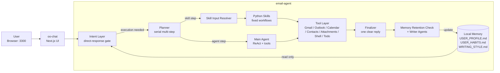

<div align="center">

# AI Email Agent

**An intent-driven, multi-agent email workspace.**
Read, search, triage, reply, unsubscribe — all with natural language.

**English** · [中文](README.zh-CN.md)

</div>

---

## Overview

**Cake** is a capstone project (UNSW COMP9900 · Team H16C) that delivers an end-to-end AI email assistant. It pairs a Python multi-agent backend with a modern Next.js chat UI, and runs as a single Docker Compose stack.

Under the hood, Cake uses a **layered orchestration architecture**. The intent layer reads the current message together with recent context, older context, and long-term local memory, and decides whether to answer directly or continue execution. If execution is needed, a **serial planner** creates one or more steps. Skill steps are filled by a **skill input resolver** and executed as YAML-declared, Python-run workflows, while open-ended steps are handled by the main tool-using agent. A finalizer then turns all step outputs into one user-facing reply, and dedicated writer agents maintain persistent profile, habit, and writing-style files.

## Features

- **Multi-Agent Intent Layer** — intent → planner → skill resolver → executor → finalizer
- **Gmail & Outlook** — switchable provider via a single env flag
- **Calendar Integration** — Google Calendar / Microsoft Calendar with approval flow
- **10+ Skills** — weekly summary, urgent triage, bug triage, resume review, draft reply, prepared send, unsubscribe discovery/execute, writing style profile, CRM init
- **Unsubscribe Workflow** — RFC 8058 one-click + mailto fallback, no browser automation
- **Persistent Memory** — `USER_PROFILE.md`, `USER_HABITS.md`, `WRITING_STYLE.md` auto-updated from activity
- **Modern Chat UI** — Next.js 16 + React 19 + Tailwind v4, streaming responses
- **One-Command Deploy** — `docker compose up` and go

## Architecture



**How the flow works**

- The **Intent Layer** is the entry gate. It reads the current turn, recent and older dialogue context, plus `USER_PROFILE.md`, `USER_HABITS.md`, and `WRITING_STYLE.md`.
- If the request is not a direct-response case, the **Planner** creates a **serial multi-step** plan instead of a single action.
- **Skill steps** go through the **Skill Input Resolver**, then run as explicit Python workflows. **Agent steps** go to the **Main Agent** directly.
- Both execution paths use the same underlying tool ecosystem, including Gmail / Outlook, calendar integrations, shell, todo, attachments, and unsubscribe tools.
- The **Finalizer** merges all completed step outputs into one user-facing reply, and a final memory pass decides what should be written back to persistent local memory.

## Quick Start

### Prerequisites

- [Docker](https://docs.docker.com/get-docker/) & Docker Compose
- An LLM API key (**one of**: OpenAI / Anthropic / Gemini / OpenOnion)
- A Gmail or Outlook account for OAuth

### 1 · Clone & Configure

```bash
cp email-agent/.env.example email-agent/.env
```

Edit `email-agent/.env`:

```env
# Pick one LLM provider
OPENAI_API_KEY=sk-...
# ANTHROPIC_API_KEY=...
# GEMINI_API_KEY=...

AGENT_MODEL=gpt-5.4
INTENT_LAYER_MODEL=gpt-5.4
SKILL_SELECTOR_MODEL=gpt-5.4

# Pick one email provider
LINKED_GMAIL=true
LINKED_OUTLOOK=false
```

### 2 · Authenticate (first time only)

```bash
docker compose run --rm email-agent setup
```

This walks you through OpenOnion auth + Google OAuth and persists tokens to `email-agent/.env`.

### 3 · Launch

```bash
docker compose up --build -d
```

Open **http://localhost:3300** 🎉

### Everyday commands

```bash
docker compose up -d       # Start
docker compose down        # Stop
docker compose logs -f     # Tail logs
```

## Project Structure

```
9900-H16C-Cake/
├── docker-compose.yml              # Two-service stack
├── README.md                       # ← you are here
├── README.zh-CN.md                 # Chinese version
│
├── email-agent/                    # Python agent backend (port 8000)
│   ├── agent.py                    # Agent composition + tool wiring
│   ├── intent_layer.py             # Intent → Plan → Execute orchestrator
│   ├── unsubscribe_workflow.py     # Unsubscribe state machine
│   ├── unsubscribe_state.py        # Per-subscription state tracking
│   ├── cli.py / cli/               # Typer CLI + interactive REPL + host server
│   ├── prompts/                    # System prompts (one per agent role)
│   │   ├── main_agent_step.md
│   │   ├── intent_layer.md
│   │   ├── planner.md
│   │   ├── skill_input_resolver.md
│   │   ├── finalizer.md
│   │   └── ...
│   ├── skills/                     # Declarative skill workflows
│   │   ├── registry.yaml           # Skill contracts (input schema + scope)
│   │   ├── unsubscribe_discovery.py
│   │   ├── unsubscribe_execute.py
│   │   ├── urgent_email_triage.py
│   │   ├── bug_issue_triage.py
│   │   ├── resume_candidate_review.py
│   │   ├── weekly_email_summary.py
│   │   ├── draft_reply_from_email_context.py
│   │   ├── send_prepared_email.py
│   │   └── writing_style_profile.py
│   ├── tools/                      # Custom tools (attachments, unsubscribe)
│   ├── plugins/                    # ReAct plugins (gmail sync, calendar approval)
│   ├── data/                       # Local cache (contacts, emails, memory)
│   ├── tests/                      # pytest suite
│   ├── Dockerfile
│   ├── docker-entrypoint.sh        # Handles co init / auth / host boot
│   ├── requirements.txt
│   ├── USER_PROFILE.md             # Auto-maintained user context
│   ├── USER_HABITS.md              # Auto-maintained habits
│   └── WRITING_STYLE.md            # Auto-derived writing style
│
└── oo-chat/                        # Next.js 16 chat UI (port 3000 → 3300)
    ├── app/                        # App Router: page.tsx, api/chat/route.ts
    ├── components/chat/            # Chat component library
    ├── hooks/                      # useChat and friends
    ├── store/                      # Zustand state
    ├── public/                     # Static assets
    ├── package.json
    └── Dockerfile
```

## Configuration

### Core env vars (`email-agent/.env`)

| Variable | Description | Default |
|---|---|---|
| `OPENAI_API_KEY` / `ANTHROPIC_API_KEY` / `GEMINI_API_KEY` | LLM provider key | — |
| `AGENT_MODEL` | Main execution model | `co/claude-sonnet-4-5` |
| `INTENT_LAYER_MODEL` | Intent classifier model | falls back to `AGENT_MODEL` |
| `PLANNER_MODEL` | Skill-planner model | falls back to `INTENT_LAYER_MODEL` |
| `FINALIZER_MODEL` | Finalizer model | falls back to `INTENT_LAYER_MODEL` |
| `LINKED_GMAIL` | Enable Gmail tools | `true` |
| `LINKED_OUTLOOK` | Enable Outlook tools | `false` |
| `AGENT_TIMEZONE` | Timezone for date tools | `Australia/Sydney` |
| `EMAIL_AGENT_TRUST` | Tool-approval policy (`strict`/`open`) | `open` (in compose) |

### Compose-level

| Variable | Description | Default |
|---|---|---|
| `OO_CHAT_PORT` | Host port for the chat UI | `3300` |

## Development

### Run the backend without Docker

```bash
cd email-agent
python -m venv .venv && source .venv/bin/activate
pip install -r requirements.txt
python cli.py host --port 8000
```

### Run the UI without Docker

```bash
cd oo-chat
npm install --install-links
npm run dev   # http://localhost:3000
```

Point the UI at your backend by setting `DEFAULT_AGENT_URL=http://localhost:8000`.

### Tests

```bash
cd email-agent
pytest -q              # full suite
pytest -q tests/test_intent_layer.py   # single module
```

## 🗺️ Roadmap

### Completed Features

- [x] Chat Interface
- [x] Smart Email Drafting
- [x] Writing Style Learning
- [x] Urgency Detection
- [x] Weekly Email Summary
- [x] Meeting Scheduling
- [x] Unsubscribe Manager

### Project Highlights

- [x] Multi-agent intent layer — Intent → Planner → Resolver → Executor → Finalizer
- [x] Declarative skill registry — YAML contracts (`scope` / `used_tools` / `input_schema`)
- [x] Dual email provider — Gmail **and** Outlook, switchable via one env flag
- [x] Extra production skills — `bug_issue_triage`, `resume_candidate_review`, `init_crm_database`
- [x] Stateful unsubscribe — local state filters out already-unsubscribed senders
- [x] Calendar approval plugin — mutating calls pause for user preview before execution
- [x] Self-maintained user memory — `USER_PROFILE.md` + `USER_HABITS.md` auto-updated by a dedicated writer agent
- [x] One-command Docker Compose deploy

## 👥 Team

**UNSW COMP9900 · Team H16C**

- Haokun Yang
- Haoyuan Xiang
- Lucia Luo
- Qifan Zhuo
- Wenyu Ding
- Zenglin Zhong

## 📜 License

Apache License 2.0 — see [`email-agent/LICENSE`](email-agent/LICENSE).

## 🙌 Acknowledgements

Built on top of [ConnectOnion](https://connectonion.com) — the Python agent framework powering the tool, memory, and plugin layers.

---

<div align="center">
<sub>Made with by <b>UNSW COMP9900 Team H16C</b></sub>
</div>
