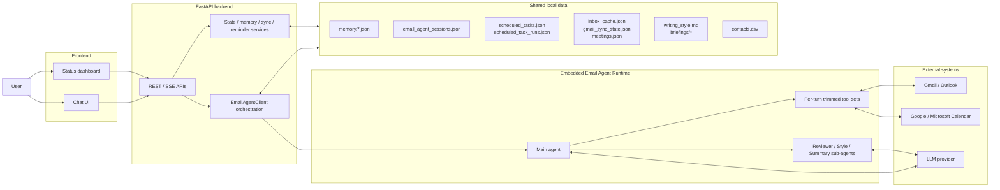

# EmailAI current architecture diagram

This document describes only what actually exists in the repository and still runs on the main path.

## System layers



## Main flows

### 1. Chat flow

```text
Frontend
  -> /agent/chat or /agent/chat/stream
  -> EmailAgentClient
  -> Routing + prompt assembly + memory injection
  -> Create main agent for current bundle
  -> Run tools / generate drafts / review
  -> Write back session, memory, pending actions
  -> Return reply / review / draft_session
```

### 2. Background flow

```text
DashboardStatusService.start_background_sync()
  -> GmailSyncService background loop
  -> ScheduledTaskService background loop
  -> Produce reminders / daily briefing / meeting brief / follow-up digest / memory curation
  -> Dashboard and read-only APIs consume these results
```

## Key boundaries

- The backend is the orchestration boundary; the frontend does not call the agent directly.
- The agent is an in-process runtime, not a separately deployed remote service.
- High-risk mailbox actions use `queue -> confirm -> execute`, not direct execution.
- Gmail sync, watch, and push are system services, not prompt inference.
- Memory splits into workflow state, structured preferences, event logs, and curated user profile.

## Most important shared data today

- `data/memory/*.json`
  Preferences, tasks, summaries, event logs, curated user profile.
- `data/email_agent_sessions.json`
  Conversation history, pending draft confirmation, pending actions.
- `data/inbox_cache.json`
  Inbox operational cache.
- `data/gmail_sync_state.json`
  Gmail sync / watch / push state.
- `data/scheduled_tasks.json`
  Scheduled task definitions.
- `data/scheduled_task_runs.json`
  Scheduled task run records.

## Current architectural takeaway

EmailAI is not “one free autonomous agent” today. It is:

**Strong backend orchestration + embedded runtime + local state files + controlled tool execution**

That is also the most stable shape of the current code.
