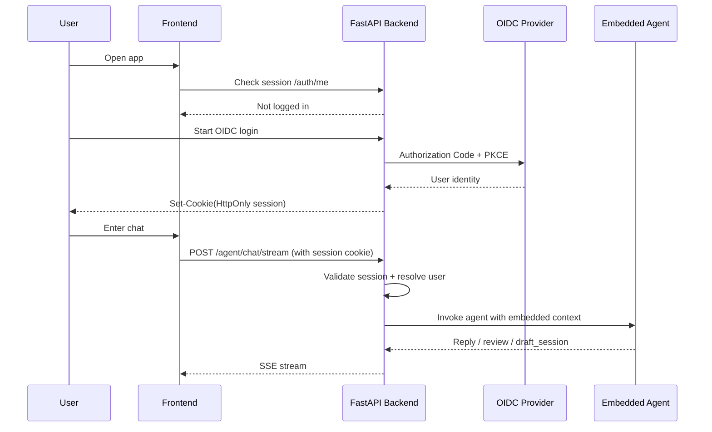

# EmailAI Frontend, Backend, and Agent Security Plan

## 1. Background

The real runtime shape of this repo is not `frontend -> remote agent`, but:

```text
frontend (Next.js)
  -> backend (FastAPI)
  -> embedded agent runtime
  -> Gmail / Outlook / Calendar / LLM provider
```

The agent is part of the backend runtime, not a separate public service the browser talks to directly.

That matters: the best security model here should not blindly copy oo-chat’s “browser holds a long-lived private key and signs agent requests.”

## 2. Design Goals

This plan aims for:

- Fit for the current architecture
- Minimal change
- Clear security boundaries
- Room to grow to multi-user
- Friendly to SSE chat streams and mailbox OAuth

This plan does not aim for:

- Browser-direct-to-agent
- Custom message signing protocols
- Heavy service mesh or zero-trust from day one

## 3. Decision

**Recommended: `OIDC login + backend server-side session + backend-exclusive agent invocation`.**

Specifically:

1. The frontend talks only to the FastAPI backend.
2. Users sign in to the backend via Google / Microsoft OIDC.
3. After login, the backend issues an `HttpOnly` session cookie.
4. Chat, settings, and dashboard APIs are all session-checked on the backend.
5. The agent is not directly reachable from the browser; it trusts the backend only.
6. Backend and embedded agent are in-process calls—no extra “link encryption” between them.

This is the simplest, most stable option that matches the existing code layout.

## 4. Why Not oo-Chat-Style Frontend Signing

`oo-chat` uses Ed25519 identities in the browser and signs agent requests—good when the browser connects to a remote agent network.

This project is a poor fit because:

1. **The agent does not expose a standalone service.**
   The backend is the orchestration boundary; the frontend already reaches the agent through the backend.

2. **Long-lived private keys in the browser are low benefit, high risk.**
   Keys in `localStorage` turn XSS into identity theft.

3. **What you must protect is business APIs and data ownership.**
   Mature `OIDC + server session` beats custom signing here.

## 5. Boundaries and Mechanisms

| Boundary | Recommended mechanism | In main scope? |
| --- | --- | --- |
| Browser -> Backend | `HTTPS` + `OIDC` + `HttpOnly Session Cookie` | Yes |
| Backend -> Embedded Agent | In-process calls, no network | Yes |
| Backend -> Gmail / Outlook / LLM | Vendor OAuth / API key + HTTPS | Yes |
| Provider Webhook -> Backend | Bearer or OIDC validation | Yes |
| Backend -> Standalone Agent (future) | mTLS or short-lived service JWT | No—future phase |

## 6. Recommended Design Details

### 6.1 User authentication

Standard `OIDC Authorization Code + PKCE`.

Preferred order:

- Phase 1: Google OIDC
- Phase 2: Microsoft OIDC

Reasons:

- Strong natural fit with Gmail / Outlook
- Low user confusion
- No need for Auth0 / WorkOS / Keycloak to start

Suggested library:

- FastAPI side: `Authlib`

Minimum identity fields to persist after login:

- `user_id`
- `provider` (`google` or `microsoft`)
- `email`
- `email_verified`
- `name`
- `picture` (optional)

### 6.2 Session model

Use **server-side session**, not JWT in frontend `localStorage`.

Suggested implementation:

- Cookie holds only a random `session_id`
- Session payload lives server-side
- Production: prefer `Redis`
- Local dev: in-memory or file fallback—not production-grade

Cookie attributes:

- `HttpOnly=true`
- `Secure=true` (may disable locally)
- `SameSite=Lax`
- `Path=/`

Session policy:

- Rotate `session_id` after login
- Absolute expiry: 8 hours
- Idle expiry: 2 hours
- Logout deletes server session and clears cookie

### 6.3 API authorization

These endpoints should require login by default:

- `/agent/chat`
- `/agent/chat/stream`
- `/agent/conversations/*`
- `/dashboard/*`
- `/settings/*`
- `/calendar/*`

Keep open only:

- `/health`
- `/ready`
- `/agent/health` (deployment-dependent)
- Third-party webhooks, e.g. `/integrations/gmail/push`

Add shared auth dependencies, e.g.:

- `require_user()`
- `optional_user()`

All business APIs use `require_user()` for the current user—do not trust `user_id` from the client.

### 6.4 Authorization model

Authentication answers “who you are”; authorization answers “what you can access.”

Minimal viable model:

1. Each `conversation_id` binds to `owner_user_id`
2. Each draft session binds to `owner_user_id`
3. Each connected mailbox binds to the signed-in user
4. Agent runtime memory, contacts, and draft state are isolated per user

So:

- Client sends only `conversation_id`
- Backend checks ownership against the session user
- Agent does not make final authorization calls

**Authorization must live in the backend.**

### 6.5 Transport security from frontend to backend

Production must enforce `HTTPS`.

Recommended:

- TLS termination at reverse proxy or platform edge
- Backend accepts frontend only from trusted domains
- CORS allowlist—no `*`
- Frontend requests use `credentials: 'include'`

Frontend API calls live in `frontend/src/lib/api/agent.ts`; add credentialed requests consistently.

### 6.6 CSRF and browser security

Because cookies are used, mutating endpoints need CSRF awareness.

Simple stable approach:

- `SameSite=Lax` on cookies
- Validate `Origin` on mutating requests
- Allow only the production frontend origin

If cross-site deployment gets complex, add double-submit CSRF tokens later.

Also enable:

- Strict CSP
- Do not put access tokens / session data in `localStorage`
- Do not log sensitive tokens, cookies, or OAuth secrets

### 6.7 Backend vs agent security boundary

The embedded agent has no separate network hop to the backend.

So:

- **No extra transport encryption here**
- **No frontend signing to the agent**

Correct pattern:

- Backend is the only trusted caller
- Backend injects signed-in user context into agent requests
- Agent consumes injected context only—no browser identity

Explicit context in backend→agent calls:

- `user_id`
- `email`
- `provider`
- `conversation_id`
- `mailbox_account_id`

### 6.8 Provider OAuth and webhooks

Mailbox OAuth and “user logs into EmailAI” are separate identity chains.

Keep layers:

- App login: OIDC session
- Mailbox access: Google / Microsoft OAuth

For webhooks, the repo already starts from:

- `backend/app/services/gmail/gmail_push_auth.py`

Continue:

- Webhooks validate signature or OIDC token separately
- Do not mix with browser session

### 6.9 Static data and token storage

Much runtime state lives under `./data`.

Minimum requirements:

- No session in frontend `localStorage`
- No provider refresh tokens in frontend state
- `.env` and provider secrets not in frontend bundles

Hardening order:

1. Login state and API auth
2. Persist long-lived OAuth tokens with encryption

For encryption:

- Inject `APP_DATA_ENCRYPTION_KEY` via backend env
- Use `AES-GCM` or symmetric crypto from Python `cryptography`
- Encrypt only high-sensitivity fields: refresh tokens, provider secrets, session secrets

Important hardening, not blocking for first launch.

## 7. Recommended Request Flow



## 8. Implementation Touchpoints

### 8.1 Backend

Add:

- `backend/app/auth/oidc.py`
- `backend/app/auth/session.py`
- `backend/app/auth/deps.py`

Modify:

- `backend/app/main.py`
- `backend/app/services/agent/email_agent_client.py`
- `backend/app/services/*draft*`
- `backend/app/services/*memory*`

New endpoints:

- `GET /auth/login/google`
- `GET /auth/callback/google`
- `GET /auth/login/microsoft`
- `GET /auth/callback/microsoft`
- `GET /auth/me`
- `POST /auth/logout`

Structural changes:

- Chat endpoints require login
- Conversation and draft sessions bind owners
- Memory / settings / dashboard scoped to current user
- Validate `Origin` on mutating requests

### 8.2 Frontend

Modify:

- `frontend/src/lib/api/agent.ts`
- `frontend/src/lib/api/settings.ts`
- `frontend/src/lib/api/*`

Main changes:

- All requests use `credentials: 'include'`
- On `401`, redirect to login or show re-login UI
- Add `/auth/me` for current user
- Do not store business login tokens in the frontend

### 8.3 Configuration

Environment variables to add:

- `SESSION_SECRET`
- `SESSION_COOKIE_NAME`
- `SESSION_COOKIE_SECURE`
- `SESSION_MAX_AGE_SECONDS`
- `SESSION_IDLE_TIMEOUT_SECONDS`
- `GOOGLE_OIDC_CLIENT_ID`
- `GOOGLE_OIDC_CLIENT_SECRET`
- `MICROSOFT_OIDC_CLIENT_ID`
- `MICROSOFT_OIDC_CLIENT_SECRET`
- `ALLOWED_ORIGINS`
- `APP_DATA_ENCRYPTION_KEY` (phase 2)

## 9. Phased Rollout

### Phase 1: Minimum viable security

Goal: unauthenticated users cannot call backend chat APIs.

Includes:

- Google OIDC login
- Backend server-side session
- `/auth/me` and `/auth/logout`
- `/agent/*`, `/dashboard/*`, `/settings/*` protected
- Frontend fetch uses `credentials: 'include'`
- `Origin` allowlist

Note:

- For speed, single-instance in-memory session may unblock the path
- Suitable for dev or short single-instance deploys only—not final production

**This phase should be the current priority.**

### Phase 2: Multi-provider and multi-user isolation

Includes:

- Microsoft OIDC
- `owner_user_id` on conversation / draft / settings / memory
- Multiple mailboxes mapped to users

### Phase 3: Sensitive data encryption and stronger internal security

Includes:

- Encrypted OAuth tokens on disk
- Session store upgrades from single-instance fallback to Redis
- Audit log redaction
- If agent becomes a separate service later: internal mTLS or service JWT

## 10. If Agent Is Deployed Standalone Later

If `agents/email-agent` becomes a network service instead of embedded, upgrade to:

- Browser -> backend: still `OIDC + session cookie`
- Backend -> agent: short-lived service JWT or mTLS
- Agent does not trust the browser directly

Only then does “remote agent identity” like oo-chat become relevant.

Do not add that complexity prematurely under the current architecture.

## 11. Final Conclusion

For this repo, the **simplest, most stable, best-fit** approach is:

**`Google/Microsoft OIDC login + FastAPI server-side session + backend-exclusive agent invocation`**

Not:

- Long-lived frontend private keys
- Browser-direct agent
- Custom message encryption protocols

This establishes the important boundaries without changing the main architecture: **user identity, API access, session safety, and data ownership.**
